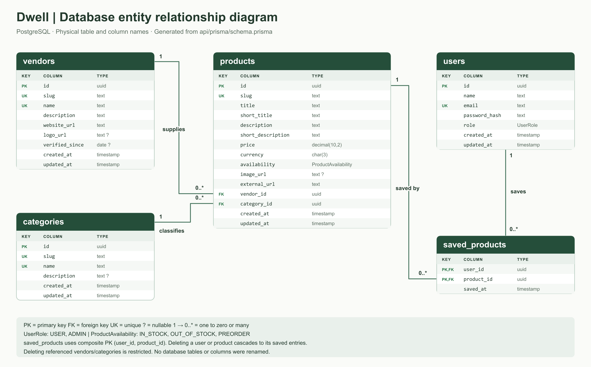
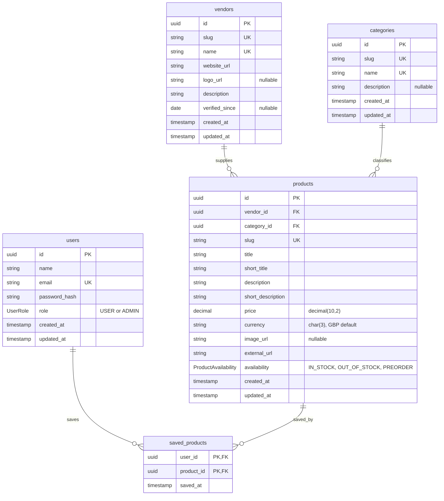

# Database schema and entity relationship diagram

The PostgreSQL schema is defined in [`../api/prisma/schema.prisma`](../api/prisma/schema.prisma), with executable SQL in `api/prisma/migrations/20260825184000_init/migration.sql`.

Download the **[PNG ER diagram](database-erd.png)** (3600 × 2240 pixels). An [SVG version](database-erd.svg) is also available. Regenerate both from the current Prisma schema with `npm run docs:erd`.

## Naming and compatibility

No database rename is required. Prisma already maps its singular models onto the plural tables `users`, `vendors`, `products`, `categories`, and `saved_products`. The brief's `user_id`, `vendor_id`, `product_id`, and `category_id` primary keys are represented by each table's `id`. Its `vendor_name` and `category_name` are `name`; `product_url` is `external_url`. These are equivalent fields, not missing data. Application properties remain camelCase through Prisma's `@map` declarations.

Each product belongs to exactly one vendor and category. Each may have zero or more products. Category data is stored once rather than duplicated in every product. Vendor/category deletion is restricted while products reference them. Deleting a user or product cascades to saved-product entries. The composite saved-product primary key prevents duplicate favourites. Visitors browse public endpoints without needing a stored role or account; registered accounts default to USER, and only ADMIN can mutate products.

## Seed data

`npm run prisma:seed` in `api` supplies 30 distinct demonstration products, five vendors and four categories. These are fictional examples; external links use example.com. All 30 products have distinct bundled images. The 23 added products use 12 generated images and 11 downloaded stock photographs; sources and generation prompts are recorded in [the image directory](../public/images/products/README.md). Set `PUBLIC_SITE_URL` to the public frontend URL including `/dwell` when seeding a new deployment.

Seeding inserts missing slugs and preserves existing records, UUIDs, relationships and credentials. It backfills missing images, the exact legacy placeholder URLs, and default localhost image URLs when moving to a configured public site. Administrator-supplied image URLs and all other product edits are preserved. An initial administrator is created only if its email is absent and `ADMIN_PASSWORD` is explicitly supplied with at least 12 characters. The catalogue is still seeded when no admin password is supplied.
